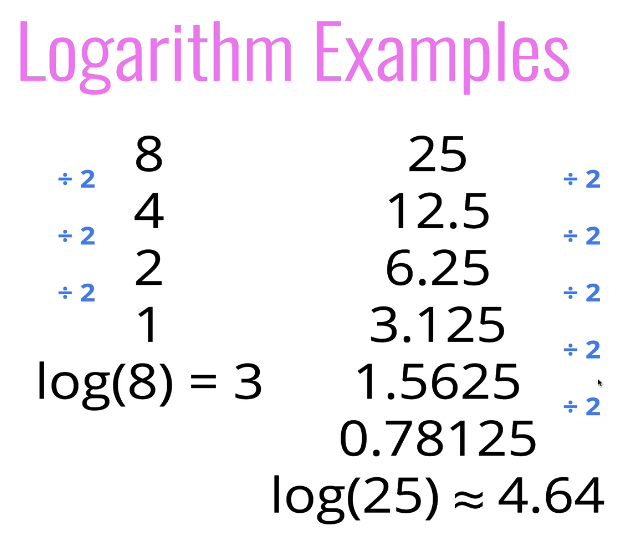

# Seção 1: Big O Notation

> 💡 Performance importa.

Assuntos abordados nesta seção:

- Necessidade da Notação Big O;
- O que é Big O Notation;
- Simplificar a Notação Big O;
- Definir "complexidade de tempo" e "complexidade de espaço";
- Avaliar a "complexidade de tempo" e "complexidade de espaço" de um algoritmo usando a Notação Big O;
- Descrever o que é logaritmo.

### Necessidade da Notação Big O

Há diversas implementações que são válidas para um mesmo problema. Elas são diferentes, não apenas em nomes e variáveis, mas em abordagens também. Mas como julgar qual delas é a melhor? É disso que trata o Big O.

É um sistema, é uma maneira de generalizar o código, falar sobre ele e comparar o código e seu desempenho com outras partes do código. É como se fosse uma tabela de classificação, com rótulos como "ótimo", "muito bom", "apenas ok", "eh..." e "terrível". Entretanto, essa classificação é feita de forma numérica.

Mas por que isso importa? Porque performance importa. Uma implementação de algoritmo pode economizar uma hora toda vez que é executada em comparação com outra implementação. Isso pode ser muito importante para um sistema que é executado milhões de vezes por dia.

Outros motivos da importância da notação Big O:

- Ajuda você a falar melhor sobre seu código;
- É importante ter um vocabulário preciso para falar sobre o desempenho do nosso código (é útil entender como sua solução se compara em desempenho com outras);
- É bom para discutir vantagens e desvantagens entre diferentes abordagens;
- Ao debugar o código, ajuda a entender as coisas que estão diminuindo a velocidade, não apenas procurar erros, ajudando identificar pontos ineficientes;
- Aparece bastante em entrevistas de emprego.

### Cronometrando nosso código

Vamos comparar a eficiência dos códigos abaixo. Ambos escrevem uma função que calcula a soma de todos os números de 1 até (e incluindo) algum número n.

```js
function addUpTo(n) {
  let total = 0;
  for (let i = 1; i <= n; i++) {
    total += i;
  }
  return total;
}
```

```js
function addUpTo(n) {
  return (n * (n + 1)) / 2;
}
```

Qual é a melhor? E o que "ser melhor" quer dizer? É rapidez? É quanto de memória é usada para guardar os dados cada vez que essa função é chamada? Legibilidade?

Geralmente, ser rápido e ocupar menos memória é o que costuma ser mais importante, mas costuma também prejudicar na legibilidade do código.

> 💡 É necessário ter um equilíbrio entre escrever um bom código e escrever um código eficiente que não consome muita memória e que também é legível.

Como eu rotulo o que é melhor? É baseado em quê?

#### O problema com o tempo

Mesmo testando a performance dos algoritmos, é preciso saber que:

- _Diferentes_ máquinas executam os códigos de forma diferente - as margens podem mudar, as medições reais podem ser diferentes e é quase garantido que haverá tempos diferentes;
- A _mesma_ máquina executará os códigos de forma diferente - o navegador e o sistema operacional podem afetar a velocidade;
- Para algoritmos rápidos, as medidas de velocidade podem não ser precisas o suficiente.

Então, como falamos qual código melhor, em termos gerais, sem ter que cronometrá-lo? Não quero fazer um teste para descobrir apenas qual é o melhor, quero saber qual é o melhor em termos gerais. E é aí que entra a Notação Big O.

#### Contando operações

> 💡 O tempo sempre será determinado pelo número de operações.

Em vez de contar os segundos exatos necessários para a execução do código, que podem mudar tanto, o que podemos fazer é contar várias operações simples que um computador precisa executar, porque isso permanece constante, independentemente de qual computador estamos.

No código abaixo, existem apenas três operações: multiplicação, adição e divisão, sem importar o tamanho do número _n_.

```js
function addUpTo(n) {
  return (n * (n + 1)) / 2;
}
```

Nesta outra solução, existem um pouco mais de operações. Além disso, tem uma variável _total_ que é criada e que é incrementada a cada iteração do loop.

```js
function addUpTo(n) {
  let total = 0;
  for (let i = 1; i <= n; i++) {
    total += i;
  }
  return total;
}
```

Então, a quantidade de operações é proporcional ao tamanho do número _n_. Se _n_ for 20, haverão 20 operações. Se _n_ for 100, haverão 100 operações. Não são apenas 3 operações, são _n_ adições.

Detalhando melhor o número de cálculos:

<code>total = 0</code>: apenas uma operação;
<code>let i = 1</code>: apenas uma operação;
<code>i <= n</code>: _n_ operações de <code><</code> e _n_ operações de <code>==</code>, totalizando _2n_ operações de comparação;
<code>i++</code>: _n_ adições e operações.

Nesse caso, a complexidade é de 5n+2 (5 operações de n + 2 que estão fora do loop), que é a mesma coisa que dizer que o número de operações cresce proporcionalmente ao número _n_.

Portanto, se _n_ for 10, haverão 52 operações. Se _n_ for 100, haverão 502 operações. Se _n_ for 1000, haverão 5002 operações.

> 💡 A ferramenta [Performance Tracker](https://rithmschool.github.io/function-timer-demo/) ajuda a entender ou traçar o tempo que as funções levam para serem executadas e obter um gráfico de desempenho.

### Introdução oficial à Notação Big O

Big O nos permite falar de uma maneira muito formal sobre como o tempo de execução de um algoritmo cresce à medida que as entradas aumentam.

É uma maneira de descrever o relacionamento entre a entrada para uma função ou à medida que ela cresce e como isso altera o tempo de execução dessa função; a relação entre o tamanho da entrada e, em seguida, o tempo relativo a essa entrada.

> 💡 Dizemos que um algoritmo é _O(f(n))_ se o número de operações simples a serem executadas for eventualmente menor que uma constante vezes _f(n)_, enquanto _n_ cresce.

Relacionamento de um input de _n_ com o tempo de execução:

- f(n) pode ser linear (f(n) = n) _enquanto n cresce, o tempo de execução cresce linearmente_;
- f(n) pode ser quadrática (f(n) = n²) _enquanto n cresce, o tempo de execução cresce quadraticamente_;
- f(n) pode ser constante (f(n) = 1) _enquanto n cresce, o tempo de execução não cresce e não é impactado, pois é sempre constante_;
- f(n) pode ser algo totalmente diferente!

Sendo assim, enquanto _n_ cresce, como isso muda para refletir no tempo de execução?

Exemplos:

1. **Sempre 3 operações: O(1)** - enquanto _n_ cresce à medida que a entrada para essa função cresce, isso não reflete no tempo de execução.

```js
function addUpTo(n) {
  return (n * (n + 1)) / 2;
}
```

2. **Número de operações limitada por múltiplo de _n_: O(_n_)** - É uma constante. Enquanto _n_ cresce, o tempo de execução cresce basicamente em proporção 1:1 e o número de operações é (eventualmente) limitado por um múltiplo de _n_. Não importa se é 1n, 5n, 10n... porque no final isso é simplificado para apenas O(n), pois estamos preocupados apenas com a ordem de magnitude.

```js
function addUpTo(n) {
  let total = 0;
  for (let i = 1; i <= n; i++) {
    total += i;
  }
  return total;
}
```

3. **0(n)** - Na parte "Going up!" do código, enquanto o _n_ cresce o loop cresce,então temos 0(n). O mesmo para a parte "At the top!", que também é 0(n). Sendo assim, é uma constante e se _n_ triplicar, o templo de execução também triplicará. Lembrando que não nos preocupamos com quantos _n_ temos, mas sim com o cenário.

```js
function countUpAndDown(n) {
  console.log("Going up!");
  for (var i = 0; i < n; i++) {
    console.log(i);
  }
  console.log("At the top!\nGoing down...");
  for (var j = n - 1; j >= 0; j--) {
    console.log(j);
  }
  console.log("Back down. Bye!");
}
```

4. **Operação O(n) dentro de uma operação O(n): 0(n²)** - Temos um loop aninhado. O primeiro loop é O(n), pois enquanto _n_ cresce, terá um número _n_ de operações. O segundo loop é também O(n). Nesse exemplo, não podemos simplificar tudo como O(n) porque os loops estão aninhados. Como essa operação é O(n\*n)- podemos simplificar para O(n²) -, significa que à medida que _n_ cresce, o tempo de execução cresce proporcionalmente na taxa n². É uma quadrática.

```js
function printAllPairs(n) {
  for (var i = 0; i < n; i++) {
    for (var j = 0; j < n; j++) {
      console.log(i, j);
    }
  }
}
```

### Simplificando Expressões Big O

Conforme vimos em exemplos anteriores, contar operações diferentes pode ser complicado e que a contagem exata realmente não importa, o que importante é a tendência geral.

Por exemplo, podemos simplificar numa operação **5n + n** por apenas **n**, já que à medida que **n** cresce, o tempo de execução cresce proporcionalmente e não importa se são duas, três, dez, vinte, cinquenta vezes.

Existem algumas regras para simplificar expressões Big O, que são consequências da definição de Big O.

- Constantes não importam;

  - Se temos algo como _O(2n)_, simplificamos para _O(n)_.
  - Se temos algo como _O)(500)_, simplificamos para _O(1)_.
  - Se temos algo como _O(13n²)_, simplificamos para _O(n²)_.

- Termos menores também não importam.
  - Se temos algo como _O(n + 10)_, simplificamos para _O(n)_.
  - Se temos algo como _O(1000n + 50)_, simplificamos para _O(n)_, não precisamos da constante 1000*n* e nem do termo 50.
  - Se temos algo como _O(n² + 5n + 8)_, simplificamos para _O(n²)_.

### Big O shorthand

- Analisar a complexidade com Big O pode ser complicado;
- Tem regras práticas que podem ajudar;
- Essas regras nem sempre irão funcionar, mas são boas para a maioria dos casos.

1. Operações aritméticas são constantes;
   - Não importa o tamanho do número a ser processado, seu computador leva aproximadamente o mesmo tempo para executar uma operação aritmética, seja 2 + 2 ou 1 milhão + 2.
2. Atribuição de variável também é constante;
   - O computador leva o mesmo tempo para criar uma variável que você sabe que X é igual a 5, ou que X é igual a 1 milhão.
3. Acessar elementos em um array (por index) ou objeto (por chave) é uma operação constante;
   - O computador leva o mesmo tempo para acessar o primeiro elemento de um array ou o último elemento de um array.
4. Em um loop, a complexidade é a duração do loop vezes a complexidade de qualquer operação que aconteça dentro do loop;
   - Se você tem um loop aninhado, e o loop externo tem complexidade O(n) e o loop interno tem complexidade O(n²), então o loop externo é O(n²).

No gráfico abaixo, vemos com clareza a diferença entre as complexidades. Perceba que O(1) é sempre uma constante em linha reta, enquanto O(n) cresce de acordo com o tamanho do _n_.

<div align="left">
    
</div>

### Complexidade de Espaço

> 💡 Complexidade de Espaço é o espaço sobre a quantidade de memória que um algoritmo usa.

Até agora, nos preocupamos apenas com a complexidade do tempo, sobre a rapidez com que os algoritmos são executados com o tempo de execução — Analisamos o tempo de execução de um algoritmo conforme o tamanho da entrada aumenta.

Mas também podemos nos preocupar com a complexidade do espaço, que é o que acontece com o espaço que um algoritmo ocupa à medida que o tamanho da entrada aumenta. Quanto de memória adicional precisamos alocar para executar o código em nosso algoritmo?

À medida que _n_ cresce, assumimos que o resultado final vai crescer. Portanto, não vamos nos preocupar com esse espaço, vamos nos preocupar com as repercussões que têm dentro do algoritmo, o que acontece dentro do algoritmo.

**Regras básicas**:

- A maioria dos primitivos (booleans, numbers, undefined, null) são constantes, ou seja, ocupam um espaço fixo na memória;
- Strings ocupam um espaço de memória proporcional ao tamanho da string, sendo assim, requerem um espaço O(_n_), onde _n_ é o tamanho da string;
- Tipos de referência são, geralmente, O(_n_), onde _n_ é o tamanho do array (para arrays) ou o número de chaves (no objeto).

Observando um exemplo para analisar a complexidade de espaço:

```js
function sum(arr) {
  let total = 0;
  for (let i = 0; i < arr.length; i++) {
    total += arr[i];
  }
  return total;
}
```

Bem, não importa qual seja o comprimento do array, temos uma variável chamada _total_ (1 número) e então estamos fazendo um _loop_, que tem uma segunda declaração dentro dele (outro número).

Essa função só tem duas variáveis e não estamos adicionando novas variáveis com base no comprimento do array. Isso significa que temos um espaço constante, ou seja, O(1).

Outro exemplo:

```js
function double(arr) {
  let newArr = [];
  for (let i = 0; i < arr.length; i++) {
    newArr.push(2 * arr[i]);
  }
  return newArr;
}
```

À medida que o comprimento do array cresce, o comprimento do novo array (uma matriz) também cresce. Na linha <code>let newArr = [] </code> vamos criar uma nova matriz, mas isso não é tão significativo quanto <code>newArr.push(2 \* arr[i]);</code>, onde temos essa nova matriz e ela está ficando cada vez mais longa diretamente na proporção do comprimento da entrada. Logo, se a matriz tiver 10 itens, estamos armazenando 10 itens em uma nova matriz.

Sendo assim, o espaço ocupado será diretamente proporcional ao tamanho da entrada, ou seja, O(_n_).

### Logs

Vimos até aqui algumas complexidades comuns: O(1), O(_n_) e O(_n²_). Entretanto, algumas vezes expressões big O envolvem expressões matemáticas mais complexas. Uma das que aparecem com muita frequência é o logaritmo.

Em vez da complexidade do tempo desses algoritmos terminar em O(_n_), eles podem terminar em O(log _n_).

#### O que é logaritmo?

Assim como divisão e multiplicação são um par, logaritmo e exponenciação são também um par. O logaritmo é o inverso da exponenciação.

Exemplo:

<code>Log2(8) = 3</code>

A leitura é feita como logaritmo de 8 na base 2 é igual a 3. E o que estamos calculando é que se elevarmos 2 a algo, que algo é esse que nos dará 8?

A resposta é 3. Se elevarmos 2 ao cubo, obteremos 8 (2³ = 8). Logo:

<code>log2(valor) = expoente</code> É respondido por <code>2^expoente = valor</code>.

> 💡 A base do logaritmo nem sempre é 2. Podemos ter logaritmos na base 10, na base 3, na base 5, etc. Mas a base 2 é a mais comum. Podemos omitir o 2 da fórmula, já que é a base mais comum, então podemos escrever apenas <code>log</code>.

> 💡 O logaritmo de um numero aproximadamente mede o número de vezes que você pode dividir esse número por 2 **antes de chegar a um valor que é menor ou igual a 1**.

Então, se tivermos um 8, dividiremos por 2 e ainda será maior que 1 (4). Se dividirmos de novo, continuará maior que 1 (2). Então alcançamos o valor 1, e não podemos dividir mais. Então, o logaritmo de 8 é 3.

Vejamos melhor o exemplo:

<div align="left">
    
</div>

Entretanto, o cálculo exato não é tão importante. O que importa é que, se olharmos para o gráfico anteriormente mostrado aqui, podemos perceber que a complexidade de tempo logarítmica é ótima! Depois da constante O(1), é a melhor complexidade de tempo que podemos ter.

#### Por que isso importa?

- Certos algoritmos têm complexidade de tempo logarítmica;
- Algoritmos de ordenação eficientes envolvem logaritmos;
- Recursão às vezes envolve complexidade de espaço logarítmica.

### 📌 Recapitulação Notação Big O

- Para analisar o desempenho de um algoritmo, nós utilizamos Notação Big O;
  - _Queremos saber como o tempo muda ou como a complexidade do espaço muda à medida que o tamanho da entrada aumenta._
- Big O pode nos dar um entendimento de alto nível de complexidade de tempo ou espaço de um algoritmo;
- Notação Big O não liga para precisão, apenas para tendências gerais (linear? quadrática? constante?);
- A complexidade do espaço ou tempo, medida pelo Big O, depende apenas do algoritmo e não do hardware que utilizamos para executá-lo;
- Big O está em todo lugar e precisamos praticar.

# Seção 2: Análise de performance de arrays e objetos

Agora que já vimos Big O, vamos analisar coisas básicas que fazemos o tempo inteiro em JS: arrays, objetos e métodos built-in. Como é a performance? Qual método pode ser mais lento? Quais são as coisas mais rápidas que podemos fazer com um array?

Objetivos desta seção:

- Entender como objetos e arrays trabalham, através das lentes do Big O;
- Explicar por que adicionar elementos ao início de um array é custoso;
- Comparar e contrastra o tempo de execução de arrays e objetos, assim como métodos built-in (como forEach e Object.keys()...).

### The Big O de objetos

Objetos são estruturas de dados não ordenadas e tudo é armazenado em pares de valores-chave. Exemplo:

```js
let instructor = {
  firstName: "Kelly",
  isInstructor: true,
  favoriteNumbers: [1, 2, 3, 4],
};
```

#### Quando utilizar objetos:

- Quando não precisamos de ordem, objetos são uma escolha excelente;
- Quando precisamos de rápido acesso / inserção e remoção.

Quando falamos em rapidez, estamos falando de tempo constante para quase todas as ações:

- Inserção: O(1);
- Remoção: O(1);
- Busca: O(N);
- Acesso: O(1).

O tempo de busca é O(N) porque, para buscar um valor, precisamos percorrer todo o objeto para ver se aquele valor existe. E se potencialmente o número de propriedades cresce à medida que N cresce, logo cresce a quantidade de tempo que leva para fazer essa busca. Entretanto, se quisermos acessar um valor, o tempo de acesso é O(1), pois não precisamos percorrer todo o objeto para encontrar aquele valor.

#### Big O de métodos de objetos

- Object.keys: O(N);
  - _Retorna todas as chaves de um objeto. O(N) porque precisamos percorrer todo o objeto para encontrar todas as chaves._
- Object.values: O(N);
  - _Retorna todos os valores de um objeto. O(N) porque precisamos percorrer todo o objeto para encontrar todos os valores._
- Object.entries: O(N);
  - _Retorna um array de arrays contendo todas as chaves e valores de um objeto. O(N) porque precisamos percorrer todo o objeto para encontrar todas as chaves e valores, o que torna esse método mais trabalhoso._
- hasOwnProperty: O(1).
  - _Verifica se um objeto possui uma determinada chave. O(1) porque não precisamos percorrer todo o objeto para encontrar a chave._

### Arrays através das lentes do Big O

O grande ponto dos arrays é que elas são ordenadas, diferentemente dos objetos, que não são. Isso é muito útil, mas pode ter custos para algumas das operações.

Quando utilizar arrays:

- Quando precisamos de ordem, arrays são uma escolha excelente;
- Quando precisamos de acesso rápido / inserção e remoção (em certas situações).

#### Big O de arrays

- Inserção: depende;
  - _Se inserirmos um elemento no final do array, o tempo de inserção é O(1). Mas se inserirmos um elemento no início do array, o tempo de inserção é O(N), pois tem relação com a quantidade de índices, que precisarão ser reindexados. Exemplo: let names = ["Michael", "Ana", "Eric"]. Se eu inserir "Gustavo" no início, os outros nomes não ocuparão mais os índices 0, 1 e 2, respectivamente, precisando ser reindexados._
- Remoção: depende;
  - _Se removermos um elemento do final do array, o tempo de remoção é O(1). Mas se removermos um elemento do início do array, o tempo de remoção é O(N), pois os índices precisarão ser reindexados._
- Busca: O(N);
  - _Para buscar um elemento em um array, precisamos percorrer todo o array para encontrar aquele elemento. E se potencialmente o número de elementos cresce à medida que N cresce, logo cresce a quantidade de tempo que leva para fazer essa busca._
- Acesso: O(1).
  - _Para acessar um elemento em um array, o tempo de acesso é O(1), pois não precisamos percorrer todo o array para encontrar aquele elemento, podemos pular imediatamente para o index, independentemente do tamanho do array._

> 💡 push() e pop() são métodos que adicionam e removem elementos do final do array, respectivamente, e são mais rápidos que shift() e unshift(), métodos que adicionam e removem elementos do início do array, respectivamente.

#### Big O de métodos de arrays

- push: O(1);
  - _Adiciona um elemento ao final do array. O(1) porque não precisamos percorrer todo o array para encontrar o final, podemos pular imediatamente para o último index, independentemente do tamanho do array._
- pop: O(1);
  - _Remove um elemento do final do array. O(1) porque não precisamos percorrer todo o array para encontrar o final, podemos pular imediatamente para o último index, independentemente do tamanho do array._
- shift: O(N);
  - _Remove um elemento do início do array. O(N) porque os índices precisarão ser reindexados._
- unshift: O(N);
  - _Adiciona um elemento ao início do array. O(N) porque os índices precisarão ser reindexados._
- concat: O(N);
  - _Concatena dois arrays. O(N) porque à medida que os arrays crescem, o tempo vai demorar e crescer proporcionalmente ao tamanho total do novo array. Tecnicamente, poderíamos argumentar que a complexidade deveria ser O(N + m), onde m é o tamanho do novo array, mas O(N) já serve._
- slice: O(N);
  - _Retorna uma cópia de uma parte de um array. O(N) porque se tentarmos copiar 10 elementos vs 1000 elementos de um array, a quantidade de tempo irá aumentar proporcionalmente ao tamanho da cópia ou de quantos elementos estamos tentando copiar._
- splice: O(N);
  - _Remove e/ou adiciona elementos de um array e, opcionalmente, os substitui por outros elementos. O(N) porque vai ser preciso reindexar os elementos._
- sort: O(N \* log N);
  - _Ordena os elementos de um array. O(N \* log N) porque o algoritmo de ordenação é baseado em comparações, e o tempo de comparação é O(log N)._
- forEach/map/filter/reduce/etc: O(N);
  - _Esses métodos iteram sobre cada elemento de um array. O(N) porque eles estão fazendo looping sobre cada elemento ou fazendo algo para cada elemento, seja um teste booleano ou apenas imprimindo o que estamos fazendo, isso envolve atuar em cada elemento ou com cada elemento. Assim, à medida que o tamanho do array aumenta, aumenta a quantidade de tempo que leva para percorrê-lo._

### 📌 Recapitulação Arrays e Objetos

- Quase tudo o que podemos fazer com arrays, todos os métodos incorporados, tem complexidade O(N);
- Ordenação é o mais lento, O(N \* log N);
- Os métodos push e pop são costantes, O(1), super rápidos;
- Objetos são rápidos em praticamente tudo, mas não há ordem para os arrays, que são ótimos quando você precisa de ordenação;
- Arrays são ótimos para ordenação, mas lembre-se que é melhor se você puder fazer adições e remoções no final do array, pois é mais rápido do que no início;
- Adicionar/remover algo tanto no começo quanto no meio de um array causa um efeito cascata de reindexação.

# Seção 3: Abordagem de Resolução de Problemas

> 💡 Muitas das estratégias que vamos discutir são baseadas no livro **_How To Solve It_**, de George Polya.

Quando encaramos um problema de código para resolver, é importante que tenhamos uma abordagem para resolver esse problema. Que passos podemos seguir para torná-lo resolvido?

_Esta primeira seção é mais sobre a abordagem básica para resolver um problema que você não sabe resolver. Passos que você pode dar, etapas para torná-lo mais fácil. A segunda seção que vem depois dessa é mais focada em código e é sobre projetos específicos e pequenas estratégias para resolver problemas._

Objetos da seção:

- Definição de algoritmo;
- Elaborar um plano para resolver algoritmos;
- Comparar e contrastar padrões de resoluções de problemas, incluindo contadores de frequência, dividir e conquistar e técnica two pointers.

### O que é um algoritmo?

Um **processo** ou um **conjunto de etapas** para realizar uma determinada tarefa.

Por que é importante saber disso?

- Quase tudo o que você faz em programação envolve algum tipo de algoritmo, sejam coisas super básicas ou um aplicativo complexo;
- É o fundamento para ser um solucionador de problemas de sucesso e um bom programador.

Como melhorar suas habilidades?

- Estabeleça um plano para resolver problemas;
- Domine os padrões comuns de resolução de problemas.

### Estratégias de resolução de problemas

- 1. Entenda o problema;
- 2. Explore exemplos concretos;
- 3. Quebre-o em partes menores;
- 4. Resolva/simplifique o problema;
- 5. Olha para trás, refatore e melhore o código.

Nesta seção, vamos explorar cada uma dessas etapas em detalhes.

## Passo 1) Entenda o problema

_Você pode criar um aplicativo copiando um passo a passo e copiar o código de outras pessoas. Mas quando se trata de resolver problemas novos e novos desafios, a coisa fica mais difícil._

_Você melhora isso com o tempo, independentemente das tecnologias que você usa, da linguagem em que está trabalhando, é realmente importante ter um forte conjunto de habilidades para resolver problemas. E muito disso virá naturalmente com o tempo, mas vale a pena ser deliberado, vale a pena ter um plano. Esse plano não vai resolver seus problemas, mas vai ajudá-lo a pensar para resolvê-lo e ajudar as soluções surgirem de maneira mais natural._

Antes de começar a sair codando ou tentar resolver o problema, é importante dar um passo atrás e garantir que você entende a tarefa que está à sua frente. O que você está tentando resolver? O que você está tentando fazer? O que você está tentando construir?

Tem diversas perguntas que você pode fazer para ajudar a garantir que você entenda o problema:

1. Você pode reafirmar o problema com suas próprias palavras?
   - _Apenas certifique-se de que você pode reformular novamente a pergunta. Mude um pouco, com suas próprias palavras, para garantir que você realmente entenda a pergunta._
2. Quais são as entradas que o problema requer?
   - _Quais são os dados que você precisa para resolver o problema._
3. Quais são as saídas que devem vir da solução do problema?
   - _Quais são os resultados que você precisa gerar ao resolver o problema._
4. As saídas podem ser determinadas a partir das entradas? Em outras palavras, você tem todas as informações necessárias para resolver o problema?
5. Como devo rotular as peças importantes de dados que são parte do problema?
   - _Qual a terminologia que você deve usar._
